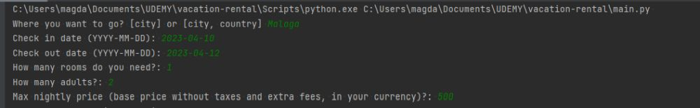
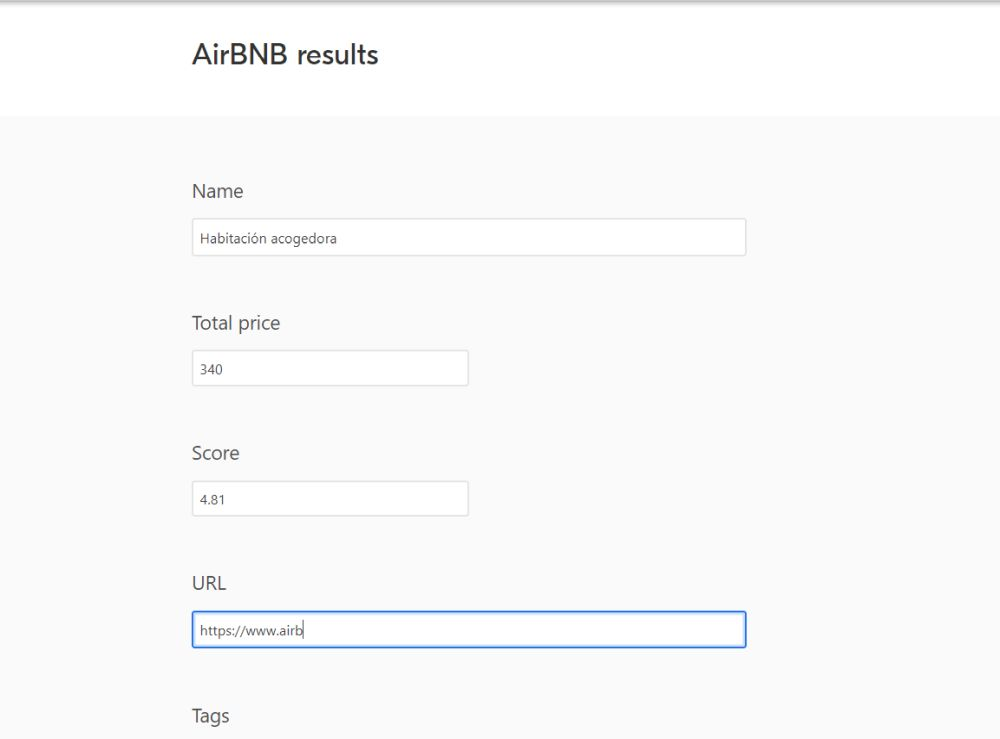
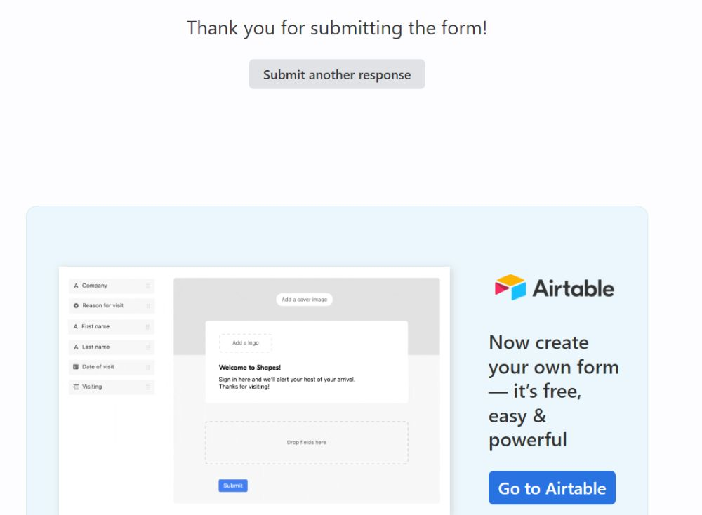
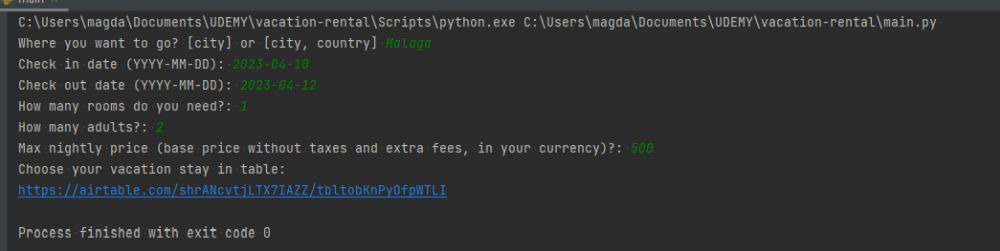
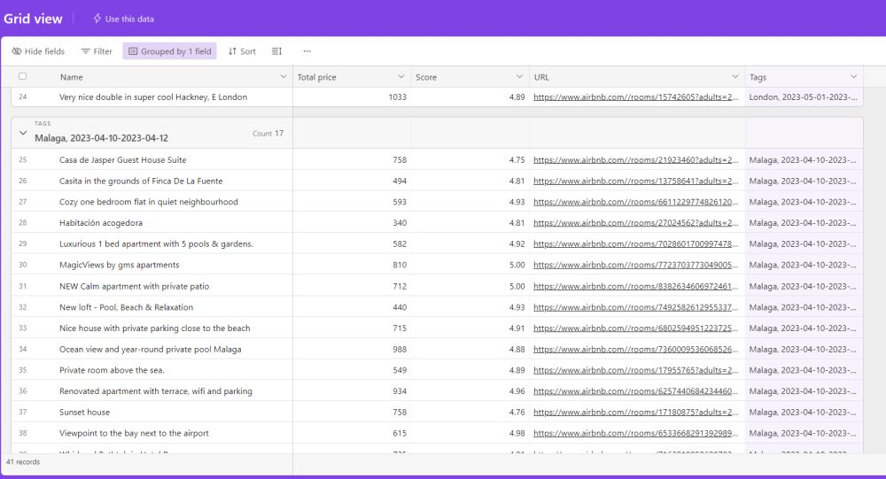
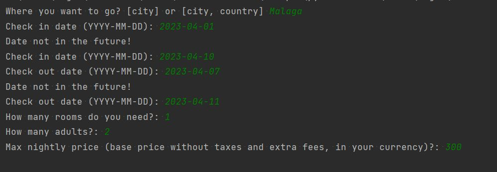
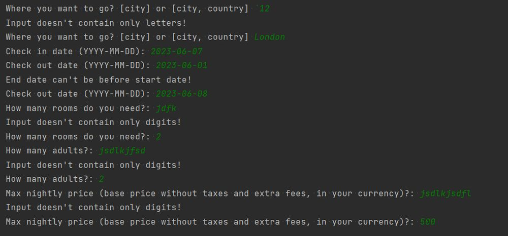

# vacation-rental
**AirBnB-scrapper** - application gets from the user info about his future vacation stay,
validates it, and searches the AirBnB database to find vacation rentals.
Then the results are collected in an Airtable table so users can pick the best choice for them.

**Opis projektu:**
Program mający za zadanie uzyskanie od użytkownika informacji nt. przyszłego wyjazdu oraz warunków 
jakie musi spełniać jego wymarzone lokum. Po uzyskaniu danych wejściowych, waliduje ich poprawność 
(dobry format, czy daty są z przyszłości, czy przedział dat jest prawidłowy). 
Następnie przeszukuje bazę AirBnB i po uzyskaniu rekordów uzupełnia nimi formularze na AirTable. 
W odpowiedzi przesyła użytkownikowi link do tabeli w AirTable z uzyskanymi noclegami. 

**Technologie:**
Python,
BeautifulSoap,
Selenium

**Rozwiązania:**
- zadanie użytkownikowi pytań w celu uzyskania danych wejściowych, po wprowadzeniu odpowiedzi jej walidacja
- uzyskanie adresu URL wyszukiwania na AirBnB i za pomocą BeautifulSoap pobranie informacji dt. noclegu
- wpisanie uzyskanych rekordów do wcześniej przygotowanego formularza za pomocą Selenium
- wyświetlenie użytkownikowi linka z tabelą z wynikami jego wyszukiwania

**Screeny:**

- Prawidłowe wyszukiwanie użytkownika:

- Wypełnianie formularza przez Selenium

- Wysłanie formularza, przejście przez Selenium do kolejnego rekordu

- Wyświetlenie odpowiedzi użytkownikowi

- Tabela z wynikami

- Nieprawidłowe wyszukiwanie użytkownika (informacje są zadawane, aż użytkownik udzieli dobrej odpowiedzi)

**Instalacja:**
Zgodnie z requirements.txt,
Uzupełnienie .env do swojej ścieżki chromedriver.exe

**Uruchomienie:**
python main.py

